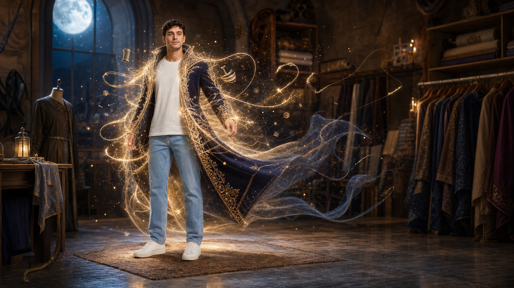
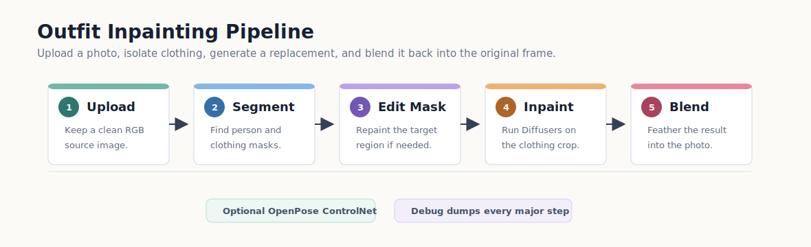
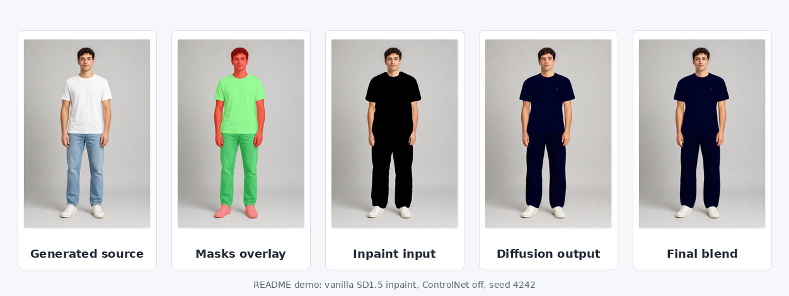
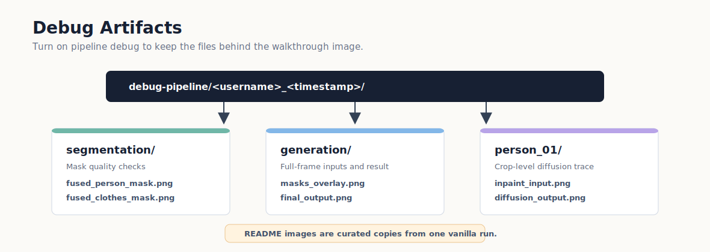

# Outfit Studio

> **Note:** This repository directory may be named `clothless-next` locally; the Python
> package and CLI are **`outfit-studio`** (`outfit_studio/`).

<p align="center">
  
</p>



AI outfit inpainting for photos. Upload a person image, segment the person and clothing,
optionally edit the masks, then inpaint a new outfit with Stable Diffusion.

The README demo assets are synthetic, fully clothed, and non-explicit. They show the
vanilla repository path using `runwayml/stable-diffusion-inpainting` with ControlNet
disabled.



## What this repo does

- Serves a Gradio UI with login, credits, examples, history, and an ImageEditor mask
  workflow.
- Uses the FASHN Human Parser (SegFormer B4) to build person and clothing masks automatically.
- Lets users repaint masks before generation, so the model changes only intended
  clothing regions.
- Runs Diffusers inpainting with SD1.5, SDXL, or local `.safetensors` / `.ckpt`
  checkpoints.
- Optionally adds OpenPose ControlNet guidance for SD1.5 checkpoints.
- Saves pipeline debug artifacts for masks, crops, inpaint inputs, diffusion output,
  blending, metadata, and final results.

## Vanilla demo

This walkthrough was produced from a fresh non-NSFW synthetic source image, then passed
through the real pipeline with:

- model: `runwayml/stable-diffusion-inpainting`
- ControlNet: off
- seed: `4242`
- steps: `24`
- prompt target: a modest, fully clothed editorial outfit



The green overlay marks clothing pixels selected for inpainting; the red overlay marks
the detected person area used for instance splitting and blending. Vanilla SD1.5 changes
the outfit region cleanly, while custom checkpoints and ControlNet can improve style
faithfulness for production use.

Useful demo files:

| File | Purpose |
|------|---------|
| `docs/assets/demo-source.png` | Synthetic, fully clothed input image |
| `docs/assets/demo-mask-overlay.png` | Person and clothing masks from segmentation |
| `docs/assets/demo-inpaint-input.png` | Crop prepared for inpainting |
| `docs/assets/demo-diffusion-output.png` | Raw vanilla SD1.5 inpaint result |
| `docs/assets/demo-blended-crop.png` | Feathered crop before full-frame compositing |
| `docs/assets/demo-result-vanilla-sd15.png` | Final feathered full-frame blend |

## Debug artifacts

Add these lines to `.env` when you want inspectable intermediates for a run:

```dotenv
OUTFIT_STUDIO_PIPELINE_DEBUG=true
OUTFIT_STUDIO_PIPELINE_DEBUG_DIR=debug-pipeline
```



Each run creates a timestamped folder. The segmentation phase records source and fused
masks; the generation phase records the final masks, per-person crop, inpaint input,
diffusion output, blended crop, full composite, and JSON metadata.

## Requirements

- Python 3.10-3.12
- [uv](https://github.com/astral-sh/uv)
- NVIDIA GPU recommended
- 8 GB+ VRAM recommended for SD1.5 inpainting

## Quick start

```bash
cp .env.example .env
make install-fast
make run
```

Open `http://localhost:7860`.

Default login:

```text
admin / admin
```

`make install-fast` creates the virtual environment from the pinned lockfile,
installs dependencies (including CUDA PyTorch and ONNX Runtime GPU support), and
downloads the configured segmentation and inpaint models.

## Make targets

| Target | Description |
|--------|-------------|
| `make install` | Create `.venv` and install pinned Python dependencies |
| `make install-fast` | Install deps from `uv.lock` and download models |
| `make download-models` | Download segmentation weights and configured inpaint checkpoint |
| `make run` | Start the Gradio UI |
| `make test` | Run non-slow unit tests |
| `make lint` | Run Ruff |
| `make docker-build` | Build the Docker image |
| `make docker-up` | Start with GPU support |
| `make docker-up-cpu` | Start without GPU |
| `make docker-download-models` | Download ML weights into the running container |
| `make docker-down` | Stop containers |
| `make docker-logs` | Follow container logs |

## Docker

Requires [Docker](https://docs.docker.com/get-docker/) and, for GPU inference,
the [NVIDIA Container Toolkit](https://docs.nvidia.com/datacenter/cloud-native/container-toolkit/install-guide.html).

```bash
cp .env.example .env
make docker-build
make docker-up          # GPU
make docker-up-cpu      # no GPU toolkit
make docker-download-models   # if not bind-mounting local weights
```

Open `http://localhost:7860`. Default login (bootstrapped on first start):

```text
admin / admin1234
```

Checkpoints bind-mount from `./models` by default. Optional `.env` overrides:

- `OUTFIT_STUDIO_HOST_MODELS_DIR` — host checkpoint path (use the real path if `./models` is a symlink)
- `OUTFIT_STUDIO_HOST_HF_CACHE` — Hugging Face hub cache (default: `~/.cache/huggingface`)

## Configuration

### Runtime `.env`

Deployment settings live in `.env`: host, port, paths, auth, credits, logging, and
pipeline debug flags.

| Setting | Purpose |
|---------|---------|
| `OUTFIT_STUDIO_HOST` / `OUTFIT_STUDIO_PORT` | Server bind address |
| `OUTFIT_STUDIO_MODELS_DIR` | Local model/checkpoint directory |
| `OUTFIT_STUDIO_OUTPUT_DIR` | Generated image output directory |
| `OUTFIT_STUDIO_DB_PATH` | SQLite database path |
| `OUTFIT_STUDIO_REQUIRE_AUTH` | Login requirement |
| `OUTFIT_STUDIO_DEFAULT_*` | Default admin and credit settings |
| `OUTFIT_STUDIO_DEBUG` / `OUTFIT_STUDIO_LOG_LEVEL` | Diagnostics |
| `OUTFIT_STUDIO_PIPELINE_DEBUG*` | Intermediate artifact dumps |

Models, prompts, and generation defaults are intentionally not stored in `.env`.

### Content and ML YAML

Branding, prompts, checkpoints, and generation tuning live in `config/`.

| File | Tracked | Purpose |
|------|---------|---------|
| `config/content.default.yaml` | Yes | Vanilla defaults shipped with the repo |
| `config/content.local.yaml` | No | Local overrides for prompts, models, URLs, and generation tuning |
| `config/content.local.yaml.example` | Yes | Template for local overrides |

```bash
cp config/content.local.yaml.example config/content.local.yaml
```

The local YAML file is merged on top of the default file. The shipped default inpaint
checkpoint is `runwayml/stable-diffusion-inpainting`; the local example can point at
custom `.safetensors` checkpoints and download URLs.

## Stack

| Component | Technology |
|-----------|------------|
| UI | Gradio 4 + ImageSlider |
| Segmentation | FASHN Human Parser (SegFormer B4) |
| Pose, optional | rtmlib ONNX + ControlNet OpenPose |
| Inpainting | Diffusers SD1.5 / SDXL inpaint |
| Auth/history | SQLite + Argon2 |

## Development

```bash
make lint
make test
pre-commit install
pre-commit run --all-files
```

Python entry points:

```bash
.venv/bin/outfit-studio-download-models
.venv/bin/outfit-studio
```
